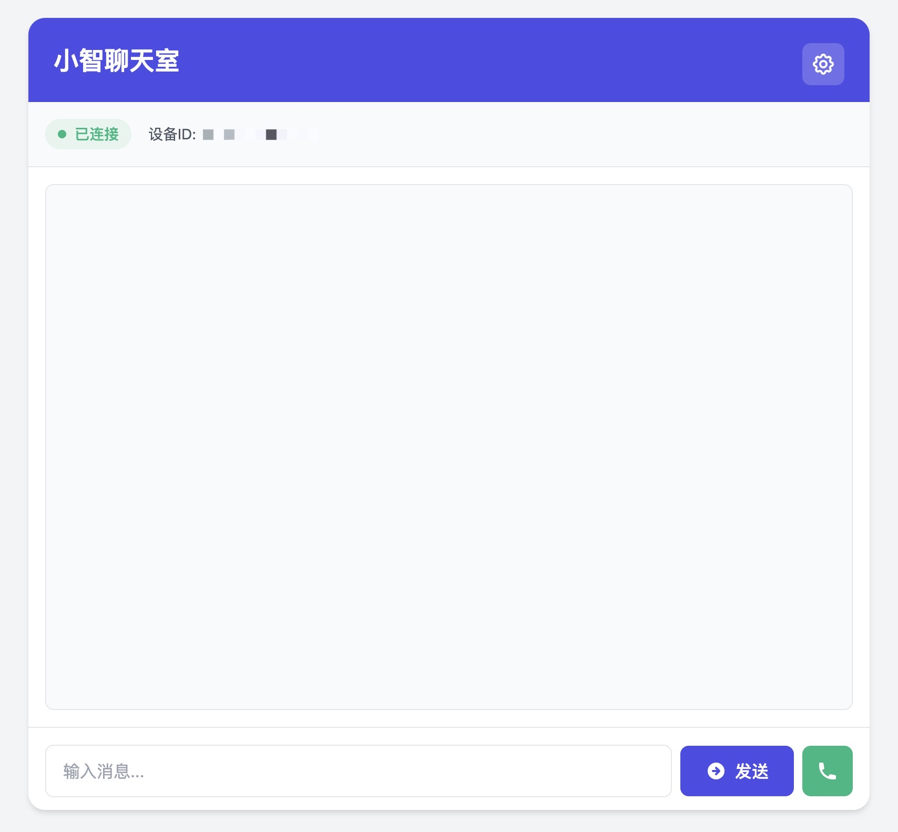

# 小智Web客户端

这是小智的Web客户端实现，提供了语音对话功能。

## 功能特点

- 实时语音对话
- 文字消息支持
- WebSocket通信
- Opus音频编码
- 自动重连机制
- 流式音频播放
- 设备认证支持

## 项目展示

<p align="center">
  
  <br/>
  <em>聊天界面 - 支持文字和语音交互</em>
</p>

<p align="center">
  
  <br/>
  <em>设置面板 - 可配置服务器地址和认证信息</em>
</p>


<p align="center">
  
  <br/>
  <em>语音通话 - 实时语音对话，波形动画反馈</em>
</p>


## 快速开始

### 方式一：源码运行

1. 配置环境变量：

从 `.env.example` 创建 `.env` 文件并设置：

```
cp .env.example .env
```

示例：

如果你使用[xiaozhi-esp32-server](https://github.com/xinnan-tech/xiaozhi-esp32-server)

```
# WebSocket服务器地址
WS_URL=ws://your_server_address:8000/xiaozhi/v1/

# 设备认证令牌
DEVICE_TOKEN=your_token

# Web服务器配置
WEB_PORT=5001
PROXY_PORT=5002
```

#### （推荐）poetry：虚拟环境

```sh
poetry install
poetry run python app.py
```

#### 直接运行

1. 安装依赖：
```bash
pip install -r requirements.txt
```


3. 启动服务：
```bash
python app.py
```

### 方式二：Docker运行

1. 使用docker-compose（推荐）：
```bash
# 构建并启动
docker-compose up -d

# 查看日志
docker-compose logs -f

# 停止服务
docker-compose down
```

2. 或者直接使用Docker：
```bash
# 构建镜像
docker build -t xiaozhi-web .

# 运行容器
docker run -d \
  --name xiaozhi-web \
  -p 5001:5001 \
  -p 5002:5002 \
  -e WS_URL=ws://your_server_address:9005 \
  -e DEVICE_TOKEN=your_token \
  xiaozhi-web
```

现在只需要运行一个命令即可启动所有服务，包括：
- Web服务器 (默认端口 5001)
- WebSocket代理服务器 (默认端口 5002)

## 访问服务

打开浏览器访问 `http://localhost:5001` 或 `http://你的IP:5001`

## 使用说明

1. 点击"开始通话"按钮开始录音
2. 再次点击结束录音
3. 等待AI回复
4. 也可以直接在输入框输入文字进行对话

## 项目结构

- `app.py`: Web服务器，提供Web界面并管理代理服务
- `proxy.py`: WebSocket代理服务器，处理音频转换和数据转发
- `templates/index.html`: 前端界面
- `static/audio-processor.js`: 音频处理模块
- `.env`: 环境配置文件
- `Dockerfile`: Docker镜像构建文件
- `docker-compose.yml`: Docker服务编排文件

## 注意事项

- 需要允许浏览器访问麦克风
- 确保服务器地址和Token配置正确
- 建议使用Chrome或Firefox浏览器
- 如果使用Docker，确保端口没有被占用

## Star History

[](https://star-history.com/#TOM88812/xiaozhi-web-client&Date)
